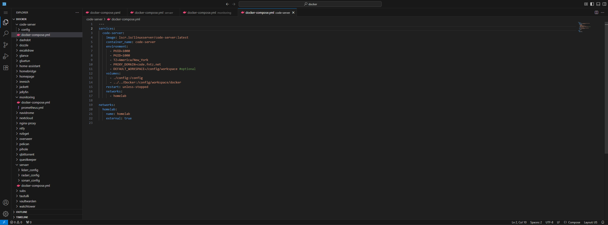

# code-server

[Code Server](https://github.com/MauriceNino/dashdot) is essentially VS Code in your web browser. I personally use it to modify Docker configurations.



## Installation

```
sudo docker compose up -d
```

See: [docker-compose.yml](./docker-compose.yml)
