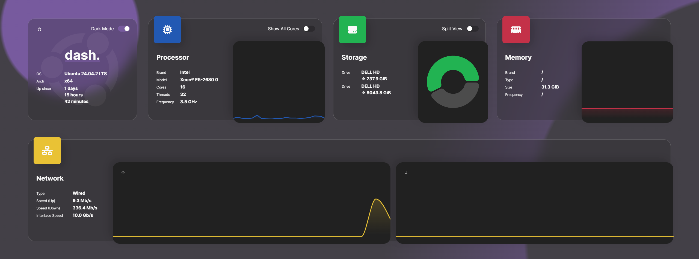

# dashdot

Dashdot is a modern server dashboard that allows you to get at-a-glance system resource metrics.



## Installation

```
docker-compose up -d
```

See: [docker-compose.yml](./docker-compose.yml)
