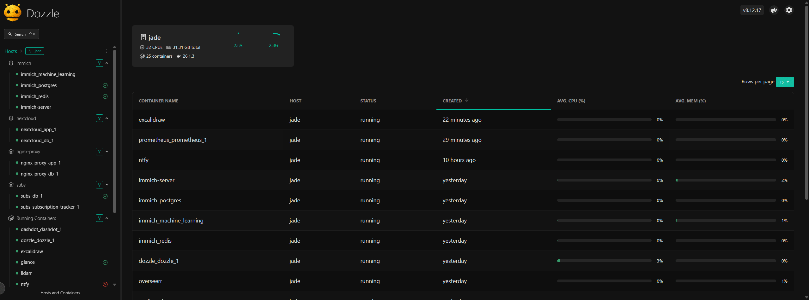

# Dozzle

[Dozzle](https://dozzle.dev/) is a lightweight web UI for monitoring logs from Docker containers.



## Installation

```
docker-compose up -d
```

See: [docker-compose.yml](./docker-compose.yml)
