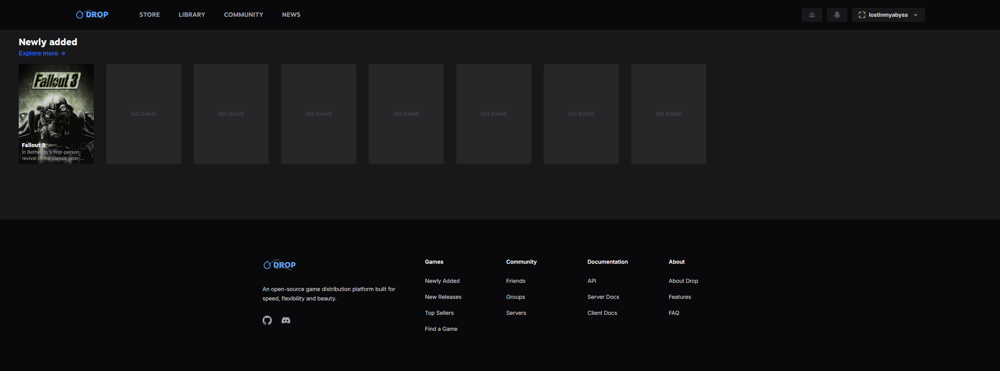

# Drop

[Drop](https://droposs.org/) is an open-source game distribution server, kind of like a self-hosted Steam. Host your own game installs & download them using the provided Client.



## Installation

```
sudo docker compose up -d
```

See [docker-compose.yml](./docker-compose.yml).

## Environment Variables

- `LIBRARY_PATH`; the host path to your games library, with the [required structure](https://docs.droposs.org/docs/library)
- `GIANT_BOMB_API_KEY`; your Giant Bomb API key
