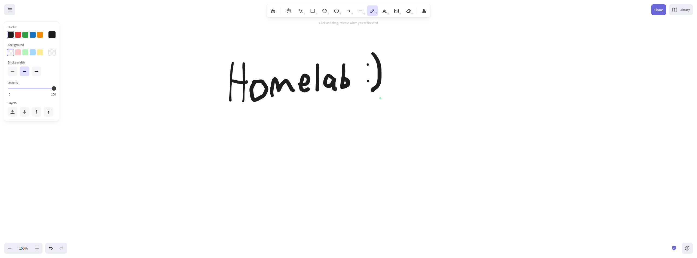

# Excalidraw

[Excalidraw](https://excalidraw.com/) is an open-source whiteboard tool that allows for easy mocking. It saves your drawings in your browser & you can easily return to them later.



## Installation

```
sudo docker compose up -d
```

See [docker-compose.yml](./docker-compose.yml).
