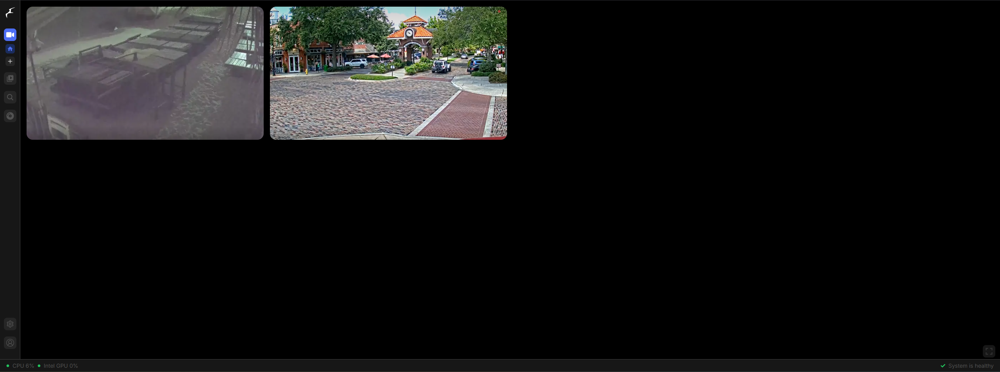

# Frigate NVR

[Frigate](https://frigate.video) is an open-source, self-hosted NVR for your IP cameras



## Installation

```
sudo docker compose up -d
```

See [docker-compose.yml](./docker-compose.yml).
