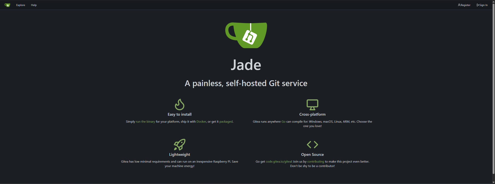

# Gitea

[Gitea](https://about.gitea.com/) is a lightweight DevOps platform for version control.



## Installation

```
sudo docker compose up -d
```

See [docker-compose.yml](./docker-compose.yml).
