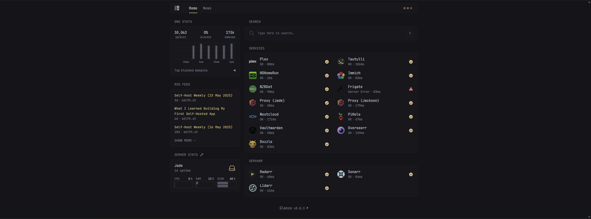

# Glance

Glance is a very versitile modern server dashboard that allows you to have one place for all your services, display content from RSS feeds and more.



## Installation

```
docker-compose up -d
```

See [docker-compose.yml](./docker-compose.yml).

## Config

This includes my configuration for services. See [config](./config) for how I have things setup.
