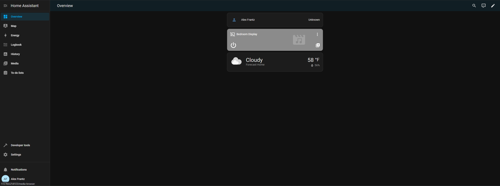

# Home Assistant

[Home Assistant](https://www.home-assistant.io/) is a self-hosted, open-source home automation tool that allows you to install plugins to control your home.



## Installation

```
docker-compose up -d
```

See [docker-compose.yml](./docker-compose.yml).
