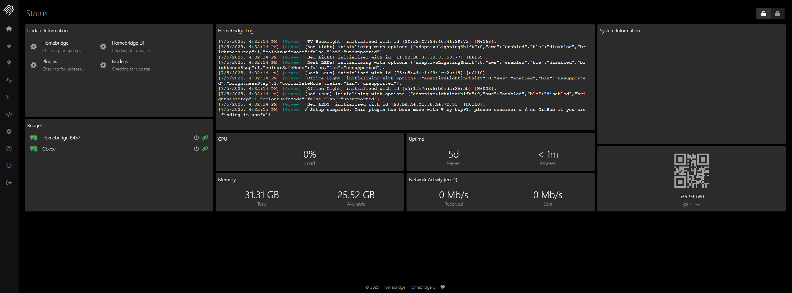

# homebridge

[Homebridge](https://caddyserver.com/) is a HomeKit compatibility bridge with various plugins that allow you to make devices that don't natively support HomeKit controllable via Homekit.



## Installation

```
sudo docker compose up -d
```

See: [docker-compose.yml](./docker-compose.yml)
