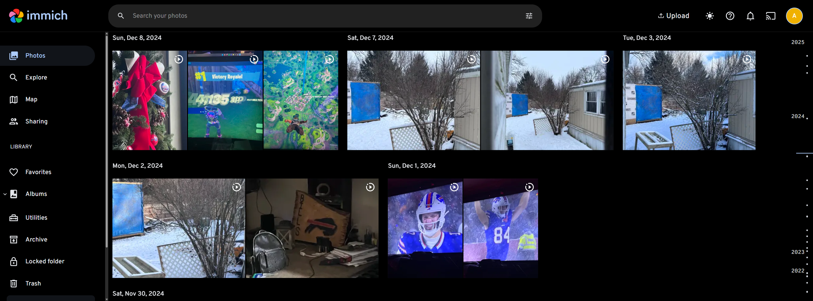

# Immich

Immich is a self-hosted alternative to cloud solutions like Google Photos for backing up your photo library.



## Installation

```
docker-compose up -d
```

See [docker-compose.yml](./docker-compose.yml).
