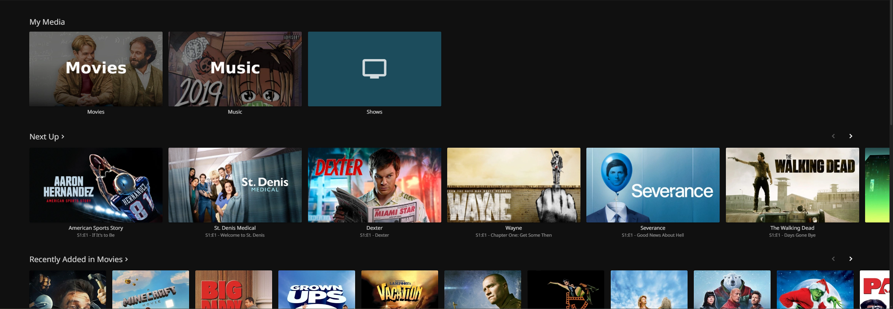

# Jellyfin

[Jellyfin](https://jellyfin.org/) is an open-source alternative to a media server like Plex. It supports the same features like library organization, live TV and more.



## Installation

```
docker-compose up -d
```

See [docker-compose.yml](./docker-compose.yml).
