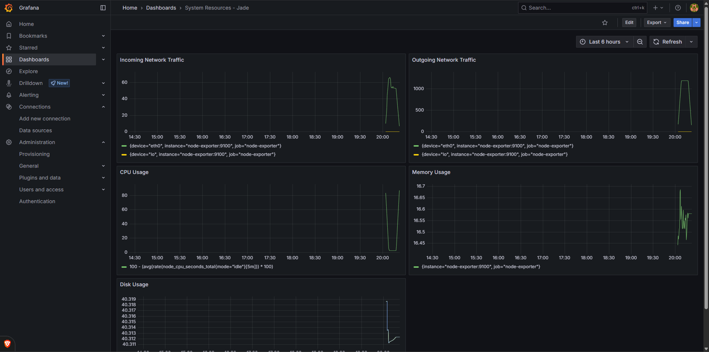
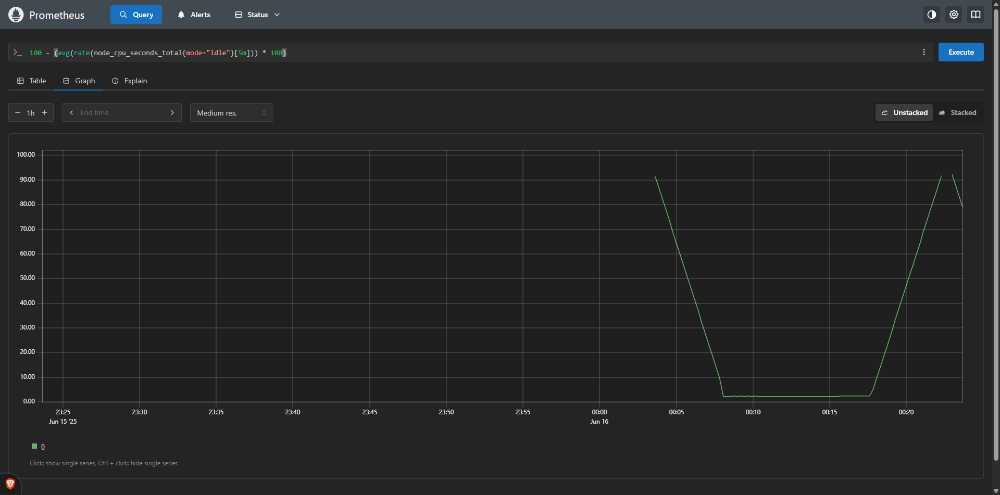

# Monitoring stack

I use a couple different services for system metric monitoring. I monitor metrics like

- disk usage
- cpu usage
- memory usage
- incoming network traffic
- outgoing network traffic
  & display them on an easy-to-visualize dash.

## Services

- **[Grafana](https://grafana.com/)** - an open-source metric visualization dashboard
- **[Prometheus](https://prometheus.io)** - an open-source system instrumentation platform
- **[CAdvisor](https://github.com/google/cadvisor)** - a visor from Google for Docker container resource metric collection

## Images

