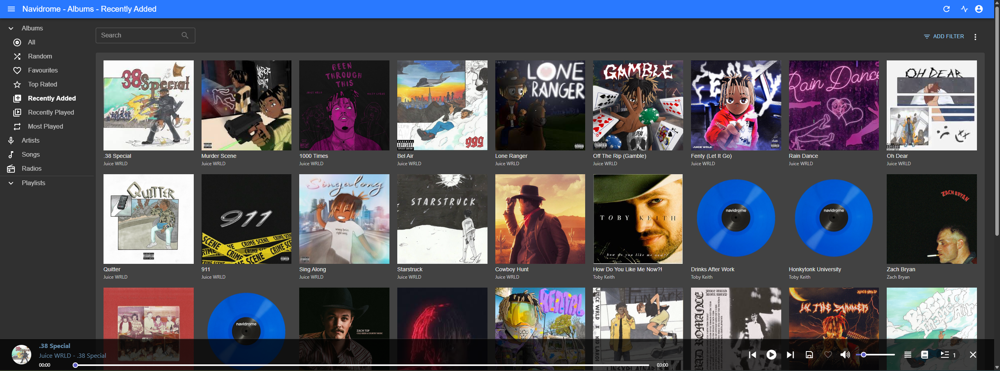

# Navidrome

[Navidrome](https://www.navidrome.org/) is a software that allows you to host & stream your own msuic files through supported clients from your own server. It has support for features like Last.fm scrobbling and more.



## Installation

```
sudo docker compose up -d
```

See [docker-compose.yml](./docker-compose.yml).
