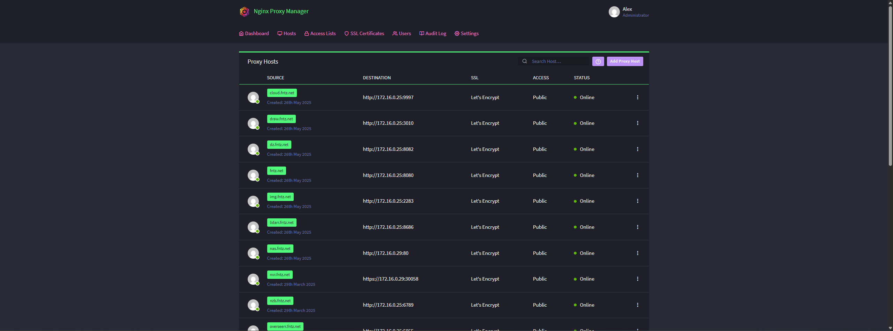

# NGINX Proxy Manager

[NPM](https://nginxproxymanager.com/) is a easily configurable reverse-proxy to setup subdomains for all your services in a single web ui. It also has really nice integrations with Let's Encrypt SSL certificates.



## Installation

```
sudo docker compose up -d
```

See: [docker-compose.yml](./docker-compose.yml)

## Themepark

This service uses a custom [Theme.park](https://theme-park.dev) theme, which is mounted as a volume. You can get it from [here](https://docs.theme-park.dev/themes/nginx-proxy-manager/).
