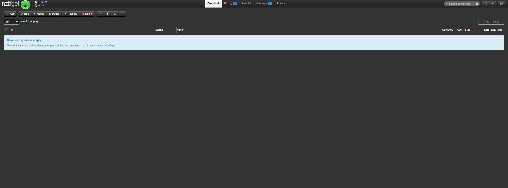

# NZBGet

[NZBGet](https://nzbget.com/) is an advanced NZB downloader, utilized for retrieving articles from Usenet groups. (You'll need a Usenet provider to use this)



## Installation

```
sudo docker compose up -d
```

See [docker-compose.yml](./docker-compose.yml).
