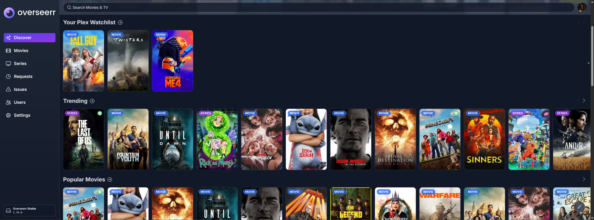

# Overseerr

Overseerr is a frontend for managing content requests & discovering media, built into the Plex ecosystem.



## Installation

```
docker-compose up -d
```

See [docker-compose.yml](./docker-compose.yml).
