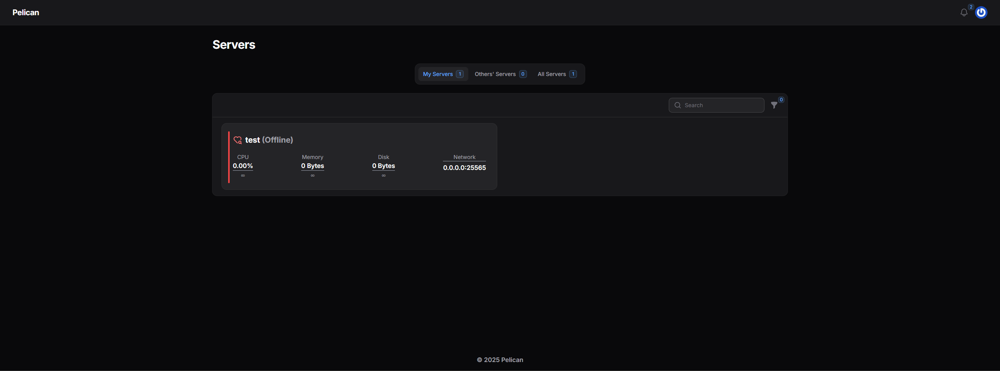

# Pelican Panel

[Pelican Panel](https://pelican.dev/) is an open-source game/app server management panel that you can use to spin up game servers in seconds. It is from some ex-maintainers of Pterodactyl & uses similar structure, Wings included.



## Installation

```
sudo docker compose up -d
```

See [docker-compose.yml](./docker-compose.yml).
