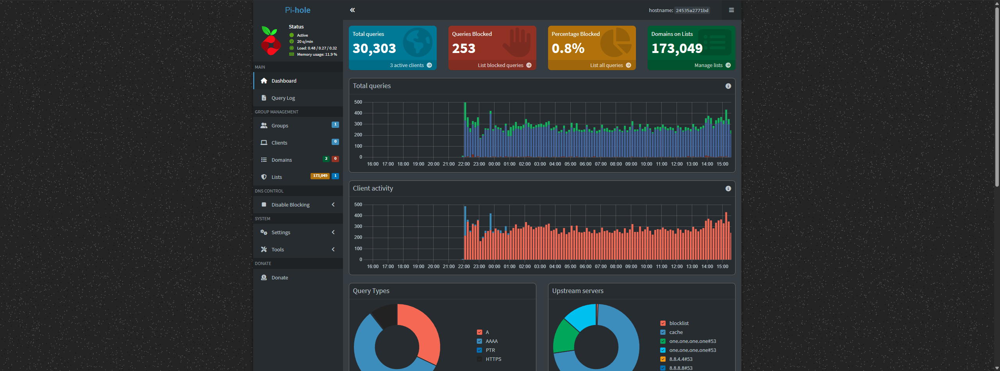

# Pi-Hole

Pi-Hole is a network-wide ad blocker & DNS server, allowing you to block ads & set custom local domains in one suite.



## Installation

```
docker-compose up -d
```

See [docker-compose.yml](./docker-compose.yml).
