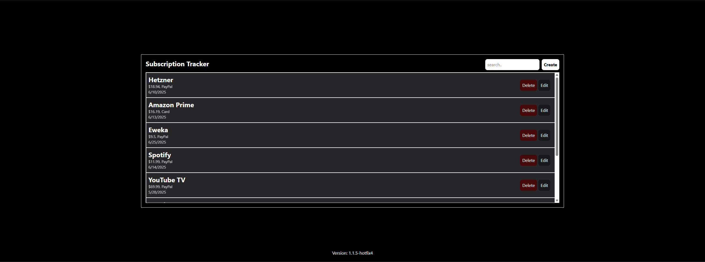

# Subscription Tracker

This one is my own project. I use it to track all of my upcoming subscriptions - it has support for notifications to Discord and more coming soon. [GitHub](https://github.com/azpha/subscription-tracker)



## Installation

```
sudo docker compose up -d
```

See [docker-compose.yml](./docker-compose.yml).
