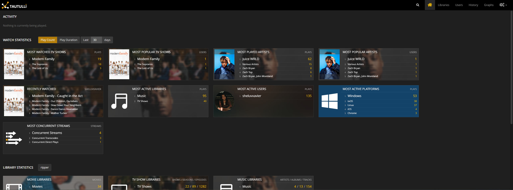

# Tautulli

[Tautulli](https://tautulli.com/) is a metrics application that tracks usage & statistics from your Plex Media Server.



## Installation

```
sudo docker compose up -d
```

See [docker-compose.yml](./docker-compose.yml).
